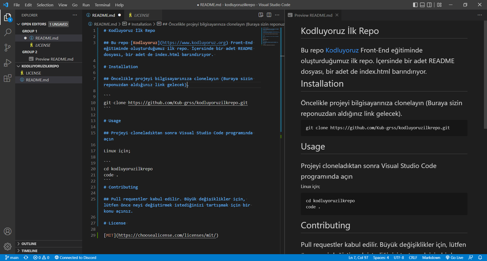

# Kodluyoruz İlk Repo

## Bu repo [Kodluyoruz](https://www.kodluyoruz.org) Front-End eğitiminde oluşturduğumuz ilk repo. İçersinde bir adet README dosyası, bir adet de index.html barındırıyor. 



# Installation

## Öncelikle projeyi bilgisayarınıza clonelayın (Buraya sizin reponuzdan aldığınız link gelecek).

```
git clone https://github.com/Kub-grss/kodluyoruzilkrepo.git
```

# Usage

## Projeyi cloneladıktan sonra Visual Studio Code programında açın

Linux için;

```
cd kodluyoruzilkrepo
code .
```
# Contributing

## Pull requestler kabul edilir. Büyük değişiklikler için, lütfen önce neyi değiştirmek istediğinizi tartışmak için bir konu açınız.

# License 

[MIT](https://choosealicense.com/licenses/mit/)